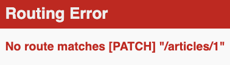

# Blog web app

## Creating the Blog Application

Rails comes with a number of scripts called generators that are designed to make your development life easier by creating everything that's necessary to start working on a particular task. One of these is the new application generator, which will provide you with the foundation of a fresh Rails application so that you don't have to write it yourself.

To use this generator, open a terminal, navigate to a directory where you have rights to create files, and type:
```
❯ rails new blog
```
This will create a Rails application called `Blog` in a `blog` directory and install the
gem dependencies that are already mentioned in `Gemfile` using `bundle install`.

*NOTE*: If you're using Windows Subsystem for Linux then there are currently some limitations on file system notifications that mean you should disable the spring and listen gems which you can do by running rails new blog -- skip-spring --skip-listen.

**TIP**: You can see all of the command line options that the Rails application builder accepts by running rails new -h.

After you create the blog application, switch to its folder:
```
❯ cd blog
```

The blog directory has a number of auto-generated files and folders that make up the structure of a Rails application. Most of the work in this tutorial will happen in the app folder, but here's a basic rundown on the function of each of the files and folders that Rails created by default:

File/Folder | Purpose
--- | ---
app/ | Contains the controllers, models, views, helpers, mailers, channels, jobs, and assets for your application. Y ou'll focus on this folder for the remainder of this guide.
bin/ | Contains the rails script that starts your app and can contain other scripts you use to setup, update, deploy, or run your application.
config/ | Configure your application's routes, database, and more.
`config.ru` | Rack configuration for Rack based servers used to start the application. For more information about Rack, see the [Rack website](https://rack.github.io/).
db/ | Contains your current database schema, as well as the database migrations.
Gemfile Gemfile.lock | These files allow you to specify what gem dependencies are needed for your Rails application. These files are used by the Bundler gem
lib/ | Extended modules for your application.
log/ | Application log files.
package.json | This file allows you to specify what npm dependencies are needed for your Rails application. This file is used by Yarn. For more information about Yarn, see the [Yarn website](https://classic.yarnpkg.com/en/).
public/ | The only folder seen by the world as-is. Contains static files and compiled assets.
Rakefile | This file locates and loads tasks that can be run from the command line. The task definitions are defined throughout the components of Rails. Rather than changing Rakefile, you should add your own tasks by adding files to the lib/tasks directory of your application.
README.md | This is a brief instruction manual for your application. You should edit this file to tell others what your application does, how to set it up, and so on.
storage/ | Active Storage files for Disk Service.
test/ | Unit tests, fixtures, and other test apparatus.
tmp/ | Temporary files (like cache and pid files).
vendor/ | A place for all third-party code. In a typical Rails application this includes vendored gems.
.gitignore | This file tells git which files (or patterns) it should ignore. See [GitHub - Ignoring files](https://help.github.com/en/github/using-git/ignoring-files) for more info about ignoring files.
.ruby-version | This file contains the default Ruby version.

## Hello, Rails!
To begin with, let's get some text up on screen quickly. To do this, you need to get your Rails application server running.

### Starting up the Web Server
You actually have a functional Rails application already. To see it, you need to start a web server on your development machine. You can do this by running the following in the blog directory:
```
❯ rails server
```

This will fire up Puma, a web server distributed with Rails by default. To see your application in action, open a browser window and navigate to `http://localhost:3000`. You should see the Rails default information page:


---

**TIP**: To stop the web server, hit Ctrl+C in the terminal window where it's running. To verify the server has stopped you should see your command prompt cursor again. For most UNIX-like systems including macOS this will be a dollar sign `$`. In development mode, Rails does not generally require you to restart the server; changes you make in files will be automatically picked up by the server.

The "Yay! You're on Rails!" page is the smoke test for a new Rails application: it makes sure that you have your software configured correctly enough to serve a page.


### Say "Hello", Rails

To get Rails saying "Hello", you need to create at minimum a *route*, a *controller* and a *view*.

A controller's purpose is to receive specific requests for the application. *Routing* decides which controller receives which requests. Often, there is more than one route to each controller, and different routes can be served by different *actions*. Each action's purpose is to collect information to provide it to a view.

A view's purpose is to display this information in a human readable format. An important distinction to make is that the *controller*, not the view, is where information is collected. The view should just display that information. By default, view templates are written in a language called eRuby (Embedded Ruby) which is processed by the request cycle in Rails before being sent to the user.

When we make a request to our Rails applications, we do so by making a request to a particular *route*. So to start off, we'll start with a route. Let's create one now in `config/routes.rb`:

```ruby
Rails.application.routes.draw do
  get "/articles", to: "articles#index"

  # For details on the DSL available within this file,
  # see https://guides.rubyonrails.org/routing.html
end
```

This is your application's *routing file* which holds entries in a special [DSL](https://en.wikipedia.org/wiki/Domain-specific_language) (domain-specific language) that tells Rails how to connect incoming requests to controllers and actions.

The line that we have just added says that we are going to match a `GET /welcome` request to `welcome#index`. This string passed as the to option represents the *controller* and *action* that will be responsible for handling this request.

Controllers are classes that group together common methods for handling a particular *resource*. The methods inside controllers are given the name "actions", as they *act upon* requests as they come in.

To create a new controller, you will need to run the "controller" generator and tell it you want a controller called "articles" with an action called "index", just like this:
```
❯ bin/rails generate controller articles index
```

Rails will create several files and a route for you.

```
create app/controllers/articles_controller.rb
 route get 'articles/index'
invoke erb
create  app/views/articles
create  app/views/articles/index.html.erb
invoke test_unit
create  test/controllers/articles_controller_test.rb
invoke helper
create  app/helpers/articles_helper.rb
invoke assets
invoke  scss
create    app/assets/stylesheets/articles.scss
```

Most important of these are of course the controller, located at `app/controllers/welcome_controller.rb` and the view, located at `app/views/welcome/index.html.erb`.

Let's look at that controller now:

```ruby
class ArticlesController < ApplicationController
  def index
  end
end
```

This controller defines a single action, or "method" in common Ruby terms, called `index`. This action is where we would define any logic that we would want to happen when a request comes in to this action. Right at this moment, we don't want this action to do anything, and so we'll keep it blank for now.

When an action is left blank like this, Rails will default to rendering a view that matches the name of the controller, and the name of the action. That view is going to be `app/views/articles/index.html.erb`.

Open the `app/views/welcome/index.html.erb` file in your text editor. Delete all of the existing code in the file, and replace it with the following single line of code:

```html
<h1>Hello, Rails!</h1>
```

If we go back to our browser and make a request to `http://localhost:3000/articles`, we'll see our text appear on the page.

### Setting the Application Home Page

Now that we have made the route, controller, action and view, let's make a small change to our routes.
In this application, we're going to change it so that our message appears at `http://localhost:3000/` and not just `http://localhost:3000/articles`. At the moment, at `http://localhost:3000` it still says "Yay! You're on Rails!".

To change this, we need to tell our routes file where the root path of our application is.
Open the file `config/routes.rb` in your editor and add this line

```ruby
root to: "articles#index"
```

Or, a slightly shorter way of writing the same thing is:
```ruby
Rails.application.routes.draw do
  get "/articles", to: "articles#index"

  root "articles#index"
end
```

This `root` method defines a root path for our application. The root method tells Rails to map requests to the root of the application to the `ArticlesController` `index` action.

Launch the web server again if you stopped it to generate the controller *(rails server)8 and navigate to `http://localhost:3000` in your browser. You'll see the "Hello, Rails!" message you put into `app/views/articles/index.html.erb`, indicating that this new route is indeed going to `ArticlesController`'s `index` action and is rendering the view correctly.

## Creating a model

So far, we have seen routes, controllers, actions and views within our Rails application. All of these are conventional parts of Rails applications and it is done this way to follow the MVC pattern. The MVC pattern is an application design pattern which makes it easy to separate the different responsibilities of applications into easy to reason about pieces.
So with "MVC", you might guess that the "V" stands for "View" and the "C" stands for controller, but you might have trouble guessing what the "M" stands for. This next section is all about that "M" part, the *model*.

A model is a class that is used to represent data in our application. In a plain-Ruby application, you might have a class defined like this:

```ruby
class Article
  attr_reader :title, :body

  def initialize(title:, body:)
    @title = title
    @body = body
  end
end
```
Models in a Rails application are designed for this purpose too: to represent particular data.

Models have another purpose in a Rails application too though. They're also used to interact with the application's database. In this section, we're going to use a model to put data into our database and to pull that data back out.

To start with, we're going to need to generate a model. We can do that with the following command:

```
❯ rails generate model article title:string body:text
```

**NOTE**: The model name here is *singular*, because model classes are classes that are used to represent single instances. To help remember this rule, in a Ruby application to start building a new object, you would define the class as `Article`, and then do `Article.new`, not Articles and Articles.new.

When this command runs, it will generate the following files:

```
invoke active_record
create  db/migrate/[timestamp]_create_articles.rb
create  app/models/article.rb
invoke test_unit
create  test/models/article_test.rb
create  test/fixtures/articles.yml
```

The two files we'll focus on here are the migration (the file at `db/migrate`) and the model.

A migration is used to alter the structure of our database, and it is written in Ruby. Let's look at this file now, `db/migrate/[timestamp]_create_articles.rb`.

```ruby
class CreateArticles < ActiveRecord::Migration[6.0]
  def change
    create_table :articles do |t|
      t.string :title
      t.text :body

      t.timestamps
    end
  end
end
```

This file contains Ruby code to create a table within our application's database. Migrations are written in Ruby so that they can be database-agnostic -- regardless of what database you use with Rails, you'll always write migrations in Ruby.

Inside this migration file, there's a `create_table` method that defines how the articles table should be constructed. This method will create a table in our database that contains an id auto-incrementing primary key. That means that the first record in our table will have an id of 1, and the next id of 2, and so on. Rails assumes by default this is the behavior we want, and so it does this for us.

Inside the block for `create_table`, we have two fields, `title` and `body`. These were added to the migration automatically because we put them at the end of the rails g model call:

```
❯ rails generate model article title:string body:text
```

On the last line of the block is `t.timestamps`. This method defines two additional fields in our table, called created_at and updated_at. When we create or update model objects, these fields will be set respectively.

The structure of our table will look like this:

id | title | body | created_at | updated_at
---|---|---|---|---
*|*|*|*|*

To create this table in our application's database, we can run this command:
```
❯ rails db:migrate
```

This command will show us output indicating that the table was created:
```
== 20200118233119 CreateArticles: migrating ===================================
-- create_table(:articles)
-> 0.0018s
== 20200118233119 CreateArticles: migrated (0.0018s) ==========================
```

Now that we have a table in our application's database, we can use the model to interact with this table.

To use the model, we'll use a feature of Rails called the `console`. The `console` allows us write code like we might in `irb`, but the code of our application is available there too.

Let's launch the console with this command:
```
❯ rails console
```

Or, a shorter version
```
❯ rails c
```

When we launch this, we should see an irb prompt:
```
Loading development environment (Rails 6.0.2.1)

irb(main):001:0>
```

In this prompt, we can use our model to initialize a new Article object:
```
irb(main):001:0> article = Article.new(title: "Hello Rails", body: "I am on Rails!")
```

When we use `Article.new`, it will initialize a new Article object in the console. This object is not saved to the database at all, it's just available in the console so far.

To save the object to the database, we need to call save:
```
irb(main):002:0> article.save
```

This command will show us the following output:
```
(0.1ms) begin transaction
Article Create (0.4ms) INSERT INTO "articles" ("title", "body", "created_at", "updated_at") VALUES (?, ?, ?, ?) [["title", "Hello Rails"], ["body", "I am on Rails!"], ["created_at", "2020-01-18 23:47:30.734416"], ["updated_at", "2020-01-18 23:47:30.734416"]] (0.9ms) commit transaction
=> true
```

This output shows an `INSERT INTO "articles"...` database query. This means that our article has been successfully inserted into our table.

If we take a look at our article object again, an interesting thing has happened:
```
irb(main):003:0> article
=> #<Article id: 1, title: "Hello Rails", body: "I am on Rails!", created_at: "2020-01-18 23:47:30", updated_at: "2020-01-18 23:47:30">
```

Our object now has the `id`, `created_at` and `updated_at` fields set. All of this happened automatically for us when we saved this article.

If we wanted to retrieve this article back from the database later on, we can do that with find, and pass that id as an argument:
```
irb(main):004:0> article = Article.find(1)
=> #<Article id: 1, title: "Hello Rails", body: "I am on Rails!", created_at: "2020-01-18 23:47:30", updated_at: "2020-01-18 23:47:30">
```

A shorter way to add articles into our database is to use Article.create, like this:
```
irb(main):005:0> Article.create(title: "Post #2", body: "Still riding the Rails!")
```

This way, we don't need to call `new` and then `save`.

Lastly, models provide a method to find all of their data:
```
irb(main):006:0> articles = Article.all
#<ActiveRecord::Relation [#<Article id: 1, title: "Hello Rails", body: "I am on Rails!", created_at: "2020-01-18 23:47:30", updated_at: "2020-01-18 23:47:30">, #<Article id: 2, title: "Post #2", body: "Still riding the Rails!", created_at: "2020-01-18 23:53:45", updated_at: "2020-01-18 23:53:45">]>
```

This method returns an `ActiveRecord::Relation` object, which you can think of as a super-powered array. This array contains both of the topics that we have created so far.

As you can see, models are very helpful classes for interacting with databases within Rails applications. Models are the final piece of the "MVC" puzzle. Let's look at how we can go about connecting all these pieces together into a cohesive whole.

## Getting Up and Running

Now that you've seen how to create a route, a controller, an action, a view and a model, let's connect these pieces together.

Let's go back to `app/controllers/articles_controller.rb` now. We're going to change the index action here to use our model.
```ruby
class ArticlesController < ApplicationController
  def index
    @articles = Article.all
  end
end
```

Controller actions are where we assemble all the data that will later be displayed in the view. In this index action, we're calling `Article.all` which will make a query to our database and retrieve all of the articles, storing them in an instance variable: `@articles`.

We're using an instance variable here for a very good reason: instance variables are automatically shared from controllers into views. So to use this `@articles` variable in our view to show all the articles, we can write this code in `app/views/articles/index.html.erb`:
```html
<h1>Articles</h1>
<ul>
<% @articles.each do |article| %>
  <li><%= article.title %></li>
<% end %>
</ul>
```

We've now changed this file from using just HTML to using HTML and ERB. ERB is a language that we can use to run Ruby code.

There's two types of ERB tag beginnings that we're using here: `<%` and `<%=`. The `<%` tag means to evaluate some Ruby code, while the `<%=` means to evaluate that code, and then to output the return value from that code.

In this view, we do not want the output of `articles.each` to show, and so we use a `<%`. But we do want each of the articles' titles to appear, and so we use `<%=`.

When we start an ERB tag with either `<%` or `<%=`, it can help to think "I am now writing Ruby, not HTML". Anything you could write in a regular Ruby program, can go inside these ERB tags.

When the view is used by Rails, the embedded Ruby will be evaluated, and the page will show our list of articles. Let's go to `http://localhost:3000` now and see the list of articles:


---

If we look at the source of the page in our browser `http://localhost:3000/`, we'll see this part:
```html
<h1>Articles</h1>

<ul>
  <li>Hello Rails</li>
  <li>Post #2</li>
</ul>
```

This is the HTML that has been output from our view in our Rails application. Here's what's happened to get to this point:
1. Our browser makes a request: GET `http://localhost:3000`.
2. The Rails application receives this request.
3. The router sees that the root route is configured to route to the `ArticlesController`'s *index* action.
4. The index action uses the `Article` model to find all the articles.
5. Rails automatically renders the `app/views/articles/index.html.erb` view.
6. The view contains ERB (Embedded Ruby). This code is evaluated, and plain HTML is returned.
7. The server sends a response containing that plain HTML back to the browser.

---


Full size [chart](https://drive.google.com/a/slicelife.com/file/d/1wKnbJSywrLK5nvpat949lsaqAiRmCJr4/view?usp=sharing)

---

We've now successfully connected all the different parts of our Rails application together: the router, the controller, the action, the model and the view. With this connection, we have finished the first action of our application.

Let's move on to the second action!

## Viewing an Article

For our second action, we want our application to show us the details about an article, specifically the article's title and body:
```
Hello Rails

I am on Rails!
```

We'll start in the same place we started with the index action, which was in `config/routes.rb`. We'll add a new route for this page.

Let's change our routes file now to this:
```ruby
Rails.application.routes.draw do
  root "articles#index"
  get "/articles", to: "articles#index"
  get "/articles/:id", to: "articles#show"
end
```

This route is another *get* route, but it has something different in it: `:id`. This syntax in Rails routing is called a *parameter*, and it will be available in the *show* action of `ArticlesController` when a request is made.

A request to this action will use a route such as `http://localhost:3000/articles/1` or `http://localhost:3000/articles/2`.

This time, we're still routing to the `ArticlesController`, but we're going to the *show* action of that controller instead of the *index* action.

Let's look at how to add that *show* action to the `ArticlesController`. We'll open `app/controllers/articles_controller.rb` and add it in, under the index action:

```ruby
class ArticlesController < ApplicationController
  def index
    @articles = Article.all
  end

  def show
    @article = Article.find(params[:id])
  end
end
```

When a request is made to this `show` action, it will be made to a URL such as `http://localhost:3000/articles/1`. Rails sees that the last part of that route is a dynamic parameter, and makes that parameter available for us in our controller through the method params. We use` params[:id]` to access that parameter, because back in the routes file we called the parameter `:id`. If we used a name like `:article_id` in the routes file, then we would need to use `params[:article_id]` here too.

The show action finds a particular article with that ID. Once it has that, it needs to then display that article's information, which will do by attempting to use a view at `app/views/articles/show.html.erb`. Let's create that file now and add this content:
```html
<h1><%= @article.title %></h1>

<p><%= @article.body %></p>
```

Now when we go to http://localhost:3000/articles/1 we will see the article:


---

But in order to navigate to it, we have to manually type in `http://localhost:3000/articles/1`. That seems a bit silly. Let's change our application a little, so that we can navigate to an article by clicking a link from the list of articles.

To add the link to an article, we need to change `app/views/articles/index.html.erb`:
```html
<h1>Articles</h1>

<ul>
  <% @articles.each do |article| %>
    <li>
      <a href="articles/<%= article.id %>">
        <%= article.title %>
      </a>
    </li>
  <% end %>
</ul>


```

This a tag will provide us with a link to the specific article. If we go back to
`http://localhost:3000/`, we'll see that we can now click on the articles:


Clicking either of these links will take us to the relevant article.

Rails has a method called `link_to` that can make that linking a little simpler. Let's use this in `app/views/articles/index.html.erb`:
```html
<h1>Articles</h1>

<ul>
  <% @articles.each do |article| %>
    <li>
      <%= link_to article.title, "/articles/#{article.id}" %>
    </li>
  <% end %>
</ul>
```

There we go, that is now a little bit cleaner. Rails has given us a way to shorten this code a little. But what you don't know yet is that this line can be made even simpler.

Rails has a feature called `routing helpers`. These are methods that can be used to
generate route paths like "/articles/#{article.id}" programatically. We'll use one of these to generate the route for our article.

To set this up, let's go back to `config/routes.rb` and change this line:
```ruby
get "/articles/:id", to: "articles#show"
```

To this:
```ruby
get "/articles/:id", to: "articles#show", as: :article
```

The `:as` option here tells Rails that we want routing helpers for this article route to be available in our application. Rails will then let us use this helper to build that route.

Let's look at how we can use that in `app/views/articles/index.html.erb` now, by changing the end of the `link_to` call to this:
```html
<h1>Articles</h1>

<ul>
  <% @articles.each do |article| %>
    <li>
      <%= link_to article.title, article_path(article) %>
    </li>
  <% end %>
</ul>
```

The `link_to` now assembles its path using the `article_path` helper. This will still generate the same `/articles/:id` route we used earlier, but now it happens programatically instead. Now there is not so much switching happening between HTML and Ruby in this code. We enter Ruby, generate a link, and exit Ruby. The code still does the same thing: it links an article's title to the show page for that article.

We now have an `index` action that lists the articles, and a `show` action that shows the title and body for a specific article. Before we move on, we'll make one more little change: we'll add a "Back" link in `app/views/articles/show.html.erb`:
```html
<h1> <%= @article.title %> </h1>

<p> <%= @article.body %> </p>

<%= link_to "Back", root_path %>
```

This will allow us to navigate back to the list of articles easily. The `root_path` comes also from router helper, which is accessible only if define `root to: ''` option in th routes.rb file.

With that small change done, let's now look at how we can create new articles within this application.

## Creating new article

To have a place to create new articles in our application, we're going to need create a new route, action and view.

We start with the `routes.rb` file to set-up the route:
```ruby
Rails.application.routes.draw do
  get '/articles', to: 'articles#index'
  get '/articles/new', to: 'articles#new', as: :new_article
  get '/articles/:id', to: 'articles#show', as: :article

  root to: 'articles#index'
end
```

The resource to create new articles will be `/articles/new,` and the route for this has very intentionally been placed above the route for the show action. The reason for this is because routes in a Rails application are matched **top-to-bottom**. If we had `/articles/:id` first, that route would match `/articles/new`, and so if we went to `/articles/new`, the show action would serve that request, not the new action. And so for this reason, we put the new route above the show action.

This `/articles/new` route will send the request to the `new` action within the `ArticlesController`, which we'll see in a minute. We've added the `:as` option here, as we will be using the `new_article_path` helper in a little while to provide a way to navigate to this form.

Next is to define the action inside the controller:
```ruby
class ArticlesController < ApplicationController
  def index
    @articles = Article.all
  end

  def show
    @article = Article.find(params[:id])
  end

  def new
  end
end
```

We can put the new action under show in the controller, because the order of methods in classes doesn't matter in Ruby.

The last think to successfully complete the route is to create the view, `new.html.erb` file under the `app/views` directory:

```html
<h1> New Article </h1>
```

To create a form within this template, you will use a *form builder*.
```html
<form action="/articles" method="post">
  <p>
    <label for="title">Title</label><br>
    <input type="text" id="title" name="title" />
  </p>

  <p>
    <label for="text">Text</label><br>
    <textarea name="text" id="text"></textarea>
  </p>

  <p>
    <input type="submit" value="Save Article" />
  </p>
</form>
```
This is an awful lot of typing for building a form. Fortunately, Rails provides helpers for us to simplify matters.

The primary form builder for Rails is provided by a helper method called `form_with`. To use this method, add this code into `app/views/articles/new.html.erb`:
```html
<h1>New Article</h1>

<%= form_with scope: :article, local: true do |form| %>
  <p>
    <%= form.label :title %>
    <%= form.text_field :title %>
  </p>

  <p>
    <%= form.label :body %>
    <%= form.text_area :body %>
  </p>

  <p>
    <%= form.submit "Save Article" %>
  </p>
<% end %>
```

The `form_with` helper method allows us to *build* a form. The first line of this provides us a block argument called `form`, and then throughout the `form` we use that to build labels and text inputs for our field.

*NOTE*: By default `form_with` submits forms using *Ajax* thereby skipping full page redirects. To make this guide easier to get into we've disabled that with `local: true` for now.

This ERB code that uses `form_with` will output a HTML form that looks very similar to the one we hand-rolled, but there are some key differences. Here's what the `form_with` outputs:

```html
<form action="/articles/new" accept-charset="UTF-8" method="post">
  <input type="hidden" name="authenticity_token" value="DIwa34..." />

  <p>
    <label for="article_title">Title</label><br>
    <input type="text" name="article[title]" id="article_title" />
  </p>

  <p>
    <label for="article_text">Text</label><br>
    <textarea name="article[text]" id="article_text">
    </textarea>
  </p>

  <p>
    <input type="submit" name="commit" value="Save Article" />
  </p>
</form>
```
The first key difference is that there is a hidden field called `authenticity_token` at the top. This is a security feature of Rails and it prevents outside people from submitting your forms maliciously using a technique called *Cross Site Request Forgery*.

The labels and fields are mostly the way they were, with a key difference: the `name` fields have an `article[]` wrapping around their values. This wrapping comes from the `scope` argument that we have passed to `form_with`. This wrapping groups all the fields of the form into one hash once they're submitted, and that will make it easy to process once they reach our application.

There's one problem with this form though. If you inspect the HTML that is generated, by viewing the source of the page, you will see that the action attribute for the form is pointing at `/articles/new`.
This is a problem because this route goes to the very page that you're on right at the moment, and that route should only be used to display the form for a new article.

The form needs to use a different URL in order to go somewhere else. This can be done quite simply with the `:url` option of `form_with`. Typically in Rails, the action that is used for *new* form submissions like this is called "create", and so
the form should be pointed to that action.

Edit the `form_with` line inside `app/views/articles/new.html.erb` to look like this:
```ruby
<%= form_with scope: :article, url: "/articles", local: true do |form| %>
```

Once the form is submitted, it will send a POST request to `/articles`. If we hit submit on that form now, we'll be shown a *Routing Error*. This error means that we haven't set up a route to handle POST requests to `/articles`. Let's add this new route:
```ruby
Rails.application.routes.draw do
  get '/articles', to: 'articles#index'
  get '/articles/new', to: 'articles#new', as: :new_article
  get '/articles/:id', to: 'articles#show', as: :article
  post '/articles', to: 'articles#create'

  root to: 'articles#index'
end
```

**TIP**: The get and post methods that we use in config/routes.rb match HTTP request methods. These methods are conventions used across all HTTP applications -- not just Rails! -- to clearly indicate what sort of action we want to do. A *GET* request is one that retrieves information. A *POST* request is one that adds information.

When Rails receives a POST `/articles` request, it will now route that request to the create action of the `ArticlesController`.
You now need to create the create action within the `ArticlesController` for this to work.

## Creating Article

We can define a create action within the `ArticlesController` class in `app/controllers/articles_controller.rb`, underneath the new action, as shown:
```ruby
class ArticlesController < ApplicationController
  def new
  end

  def create
  end
end
```

If you re-submit the form now, you may not see any change on the page. Don't worry!


This is because Rails by default returns *204 No Content* response for an action if we don't specify what the response should be. We just added the create action but didn't specify anything about how the response should be. In this case, the create action should save our new article to the database.

When a form is submitted, the fields of the form are sent to Rails as *parameters*. Yes, there are the same parameters as we saw earlier when we used `params[:id]`. These parameters can then be referenced inside the controller actions, typically to perform a particular task. To see what these parameters look like, change the create action to this:
```ruby
def create
  render plain: params[:article].inspect
end
```

The render method here is taking a very simple hash with a key of `:plain` and value of params`[:article].inspect`. The params method is the object which represents the parameters (or fields) coming in from the form. The params method returns an `ActionController::Parameters` object, which allows you to access the keys of the hash using either strings or symbols. In this situation, the only parameters that matter are the ones from the form. Thanks to the use of the `scope` option on the form, all of our form's parameters are grouped under `params[:article]`.

If you re-submit the form one more time, you'll see something that looks like the following:
```ruby
<ActionController::Parameters
    {"title"=>"Article the Third", "text"=>"The Trilogy Ends"}
    permitted: false>
```

This action is now displaying the parameters for the article that are coming in from the form. However, this isn't really all that helpful. Yes, you can see the parameters but nothing in particular is being done with them.

Let's change the create action to use the `Article` model to save the data in the database. Let's change the create action to look like this:
```ruby
def create
  article = Article.new(params[:article])
  article.save

  redirect_to article_path(article)
end
```

*NOTE*: We're not using an instance variable in this action. This is because this action redirects at the end, and since there is a redirection there is no view. So there is no need to make these variables instance variables.

Here we use some familiar code to create a new article -- we saw this previously right after we generated the `Article` model. The call to `new` and then to `save` will create a new article record in the database.

The final line, a `redirect_to`, uses `article_path` to redirect back to the show action.

If you now go to `http://localhost:3000/articles/new` you'll almost be able to create an article. Try it! You should get an error that looks like this:


Rails has several security features that help you write secure applications, and you're running into one of them now. This one is called *strong parameters*, which requires us to tell Rails exactly which parameters are allowed into our controller actions.

Why do you have to bother? The ability to grab and automatically assign all controller parameters to your model in one shot makes the programmer's job easier, but this convenience also allows malicious use. What if this form was a bank account and we allowed just anyone to add in a new field that set their balance to whatever they wished? This would end up bad for us!

We have to define our permitted controller parameters to prevent wrongful mass assignment. In this case, we want to both allow and require the `title` and `body` parameters for valid use of `create`. The syntax for this introduces `require` and `permit`. The change will involve one line in the `create` action:
```ruby
  @article = Article.new(params.require(:article).permit(:title, :body))
```

This code is quite long and is often pulled out into its own method so it can be reused by multiple actions in the same controller. Above and beyond mass assignment issues, the method is often made `private` to make sure it can't be called outside its intended context. Here is the result:
```ruby
def create
  article = Article.new(article_params)
  article.save

  redirect_to article_path(article)
end

private

def article_params
  params.require(:article).permit(:title, :body)
end
```

If we attempt to submit our form once more, this time it will succeed and we'll see the article's title and body. The URL should be `http://localhost:3000/articles/3`, indicating that we're now on the `show` action.

Before we wrap up this section, let's add a link to `app/views/articles/index.html.erb` so that we can go to the "New Article" page from there:
```html
<h1>Articles</h1>

<%= link_to "New Article", new_article_path %>

.
.
(the rest of the code)
```

Great! That's another two actions finished in our controller: `new` and `create`.

## Adding Model Validation

Sometimes, in web applications, we want to make sure certain fields are filled in.

The model file, `app/models/article.rb` is about as simple as it can get:
```ruby
class Article < ApplicationRecord
end
```

There isn't much to this file - but note that the `Article` class inherits from `ApplicationRecord`. `ApplicationRecord` inherits from `ActiveRecord::Base` which supplies a great deal of functionality to your Rails models for free. We've used some of this already: `Article.new`, `Article.all`, `Article.find` and so on.

One of these pieces of functionality is that *Active Record* includes methods to help you validate the data that you send to models and it's easy to use.

Open the app/models/article.rb file and edit it to this:
```ruby
class Article < ApplicationRecord
  validates :title, presence: true, length: { minimum: 5 }
end
```

These changes will ensure that all articles have a *title* that is at least five characters long. Rails can validate a variety of conditions in a model, including the presence or uniqueness of columns, their format, and the existence of associated objects. Validations are covered in detail in *Active Record Validations*.

This validation will now only let us save articles that have titles longer than 5 characters. Let's open up the console now and try:
```
❯ rails console
irb(main):001:0> invalid_article = Article.new
=> #<Article id: nil, title: nil, body: nil, created_at: nil, updated_at: nil>
irb(main):002:0> invalid_article.save
=> false
```

When `save` returns false, it means that the object is invalid and won't be saved to the database. To find out why, we can use this code:
```
irb(main):003:0> invalid_article.errors.full_messages
=> ["Title can't be blank", "Title is too short (minimum is 5 characters)"]
```

The `errors.full_messages` method chain shows two validation failure messages for our model:
- The title can't be blank
- The title is too short (minimum of 5 characters)

That's because we've left the title blank. Now let's see what happens when we save an article with a valid title:
```
irb(main):006:0> article = Article.new title: "Getting Started"
=> #<Article id: nil, title: "Getting Started", body: nil, created_at: nil, updated_at: nil>

irb(main):007:0> article.save
(0.1ms) begin transaction
Article Create (0.4ms) INSERT INTO "articles" ("title", "created_at", "updated_at") VALUES (?, ?, ?) [["title", "Getting Started"], ["created_at", "2020-05-07 09:56:25.693465"], ["updated_at", "2020-05-07 09:56:25.693465"]]
(0.6ms) commit transaction
=> true
```

The *save* call here has returned true, indicating that the article has passed validations. Also in the console, we can see an `Article Create` message, that contains an `INSERT INTO` database query, and so we can be confident that this article has now been inserted into our database.

Now that we've seen how to handle invalid and valid articles in the console, let's try using this same technique in our controller.

If you open `app/controllers/articles_controller.rb` again, you'll notice that we don't check the result of calling `@article.save` inside the create action.

If `@article.save` fails in this situation, we need to do something different: we need to show the form again to the user so that they can correct their mistake.
To do this, let's change the create action to either redirect to the article if the save was successful (the method returns true) or to show the new form again if the save failed:
```ruby
def new
end

def create
  @article = Article.new(article_params)

  if @article.save
    redirect_to @article
  else
    render :new
  end
end
```

The first thing to note here is that we've now switched from using a local variable article to using an instance variable, `@article`. The reason for this is the else statement. Inside that else we tell Rails to render `:new`. This tells Rails that we want the `app/views/articles/new.html.erb` view to be rendered in the case where our save fails.

Next is to to display the errors. To do that, we'll need to modify `app/views/articles/new.html.erb` to check for error messages. Add this after the header HTML element:
```html
<h1> New Article </h1>

<% if @article.errors.any? %>
<div id="error_explanation">
  <h2>
    <%= pluralize(@article.errors.count, "error") %> prohibited this article from being saved:
  </h2>
  <ul>
    <% @article.errors.full_messages.each do |msg| %>
      <li><%= msg %></li>
    <% end %>
  </ul>
</div>
<% end %>

... rest of the html
```

At the top of this view, we're now using `@article.errors` to check for any errors. The `@article` variable here will come from the *create* action, when the `app/views/articles/new.html.erb` view is rendered due to an invalid article.

Inside the check for any errors, we call `pluralize`. `pluralize` is a rails helper that takes a number and a string as its arguments. If the number is greater than one, the string will be automatically pluralized.

If we attempt to go to `http://localhost:3000/articles/new` at this point, we'll see it fail:


This is happening because we're referring to a variable called `@article` within `app/views/articles/new.html.erb`, but the `new` action does not provide this variable at all.

The path to this error is:
  1. Browser goes to `http://localhost:3000/articles/new`
  2. Rails sees `/articles/new` is the route, routes the request to the
  `ArticlesController`'s new action
  3. The *new* action is blank, and so Rails defaults to rendering
  `app/views/articles/new.html.erb`.
  4. The template attempts to reference `@article,` but it is not defined.

So to make this error go away, we need to define this @article variable.
We can do it like this in the new action inside app/controllers/articles_controller.rb:
```ruby
def new
  @article = Article.new
end
```

This @article is a brand-new `Article` object, and will be perfect for our form. It doesn't have any errors on it -- because we haven't tried saving it yet! -- and so the form will not display any errors.

If we refresh this `http://localhost:3000/articles/new` page, we should see our form renders once again.

And there we have it! We now have the ability to create new articles within our application.

## Updating Articles

Now what should happen if we make a mistake when creating an article? Well, we should have a way to edit an article and correct that mistake.

Our edit form will look just like our new form, just with a few differences: the title will say "Edit Article", not "New Article". Secondly, the fields will be filled out with the article's current values. And lastly, the submit button says "Update Article", not "Save Article".

To add this feature to our application, we're going to need to add a new route, a route just for editing articles. Let's do this now in `config/routes.rb`:
```ruby
get "/articles/:id/edit", to: "articles#edit", as: :edit_article
```

This new route is another `get` route. This time, we're routing to `/articles/:id/edit`, so that we can see that edit form for a particular article. Which article we're editing depends on that `:id` parameter in the route.

The route will be handled by the `edit` action within `ArticlesController`. We'll add that action soon.
The `as` option will provide us with a routing helper that we can use across our application to take us to this edit form for a specific article.

As a first step, let's add an "Edit" link for each article on `app/views/articles/index.html.erb`:
```html
<h1>Articles</h1>

<%= link_to "New Article", new_article_path %>

<ul>
  <% @articles.each do |article| %>
    <li>
      <%= link_to article.title, article_path(article) %>
      <%= link_to "Edit" , edit_article_path(article) %>
    </li>
  <% end %>
</ul>
```

This "Edit" link will now appear next to all of the articles at `http://localhost:3000/articles`.

Next step here is to add that action to our controller. Let's open `app/controllers/articles_controller.rb` and add that action:
```
def edit
  @article = Article.find(params[:id])
end
```

**NOTE**: We're using *edit* to render just a form to display the current values of the article. For the actual updating of the article, we'll use a different action for this shortly called *update*.

The view will contain a form similar to the one we used when creating *new* articles. Create a file called `app/views/articles/edit.html.erb` and put this content inside:
```html
<h1>Edit Article</h1>

<% if @article.errors.any? %>
  <div id="error_explanation">
    <h2>
      <%= pluralize(@article.errors.count, "error") %> prohibited this article from being saved:
    </h2>
    <ul>
      <% @article.errors.full_messages.each do |msg| %>
      <li><%= msg %></li>
      <% end %>
    </ul>
  </div>
<% end %>

<%= form_with model: @article, local: true do |form| %>
  <p>
    <%= form.label :title %><br>
    <%= form.text_field :title %>
  </p>

  <p>
    <%= form.label :body %><br>
    <%= form.text_area :body %>
  </p>

  <p>
    <%= form.submit %>
  </p>
<% end %>

<%= link_to 'Back', articles_path %>
```

The only things different in this view are the `<h1>` at the top of the view, and the `form_with`. The `form_with` is not using `scope` or `url`, but is instead using a different key called `model`.

The `model` key for `form_with` takes an instance of a model's class and builds a form for that particular object. By using `form_with` in this way, Rails will pre-populate the `title` and `body` fields in this form for us.

There's one extra feature that Rails does for us that is not immediately obvious from looking at the form itself. This feature requires us to look at the HTML source of this form. Inside this source at the top of the `<form>` element, here's what we'll see:
```html
<form action="/articles/1" accept-charset="UTF-8" method="post">
  <input type="hidden" name="_method" value="patch" />
```

Firstly, the action attribute for this form goes to a route called `/articles/1`. This path was automatically generated by Rails; in short: it uses the `article_path` helper to generate this route. The second thing to notice is that hidden field. This hidden field is a special field that will make the form do a *PATCH* request when this form is submitted, instead of the default *POST* (as is configured in the form element's method attribute).

This means that our form will make a `PATCH /articles/1` request when it is submitted. If we hit submit on the form, we'll see that this is correct, and that this route is currently missing:



This route is supposed to handle the submission of our form, but the route does not exist yet. To make this form work, we'll need to define this route. Let's go back to `config/routes.rb` and define this route:
```ruby
Rails.application.routes.draw do
  root "articles#index"
  get "/articles", to: "articles#index"
  get "/articles/new", to: "articles#new", as: :new_article
  get "/articles/:id", to: "articles#show", as: :article
  post "/articles", to: "articles#create"
  get "/articles/:id/edit", to: "articles#edit", as: :edit_article
  patch "/articles/:id", to: "articles#update"
end
```

This patch method will generate us a route for `PATCH /articles/:id` requests. We use the *PATCH HTTP* routing method for when we want to modify an existing resource.

These requests to PATCH `/articles/:id` will be routed to the update action in our `ArticlesController`. Let's add that action now underneath the edit action:

```ruby
def edit
  @article = Article.find(params[:id])
end

def update
  @article = Article.find(params[:id])

  if @article.update(article_params)
    redirect_to @article
  else
    render 'edit'
  end
end
```

The new method, `update`, is used when you want to update a record that already exists, and it accepts a hash containing the attributes that you want to update. As before, if there was an error updating the article we want to show the form back to the user.

We reuse the `article_params` method that we defined earlier for the `create` action. We want to accept the same parameters here, and so it makes sense to use the same `article_params` method.

*TIP*: It is not necessary to pass all the attributes to update. For example, `if @article.update(title: 'A new title')` was called, Rails would only update the title attribute, leaving all other attributes untouched.

Let's try this again. We'll go to `http://localhost:3000`, click the "Edit" link next to one of the articles and change its title. When this happens and we submit the form, we will see the new title for that article.

On this page, we're currently missing a way to edit an article. This route that we're currently on is `http://localhost:3000/articles/1`, and we know that the route matches to `app/views/articles/show.html.erb`. In this file we can add a link to edit the article:
```html
<%= link_to "Edit", edit_article_path(@article) %>
```

This now finishes our adventures in adding the ability to edit an article in this application.

## Using partials to clean up duplication in views

Our *edit* page looks very similar to the *new* page; in fact, they both share almost same code for displaying the form. Rails has yet another great feature that we can use to reduce this duplication and this feature is called *partials*.

Partials allow us to extract out common pieces of views into a file that is then shared across many different views, or in this case, just two views. Let's remove this duplication by using a partial. By convention, partial files are prefixed with an underscore.

Create a new file `app/views/articles/_form.html.erb`. We're going to copy most of `app/views/articles/edit.html.erb` into this new partial file:
```html
<% if article.errors.any? %>
  <div id="error_explanation">
    <h2>
      <%= pluralize(article.errors.count, "error") %> prohibited this article from being saved:
    </h2>
    <ul>
      <% article.errors.full_messages.each do |msg| %>
      <li><%= msg %></li>
      <% end %>
    </ul>
  </div>
<% end %>

<%= form_with model: article, local: true do |form| %>
  <p>
    <%= form.label :title %><br>
    <%= form.text_field :title %>
  </p>

  <p>
    <%= form.label :body %><br>
    <%= form.text_area :body %>
  </p>

  <p>
    <%= form.submit %>
  </p>
<% end %>
```

This partial can now be used in both the *new* and *edit* views. Let's update the new view:
```ruby
<h1>New Article</h1>

<%= render 'form', article: @article %>
```

Then do the same for the `app/views/articles/edit.html.erb` view:
```ruby
<h1>Edit Article</h1>

<%= render 'form', article: @article %>

<%= link_to 'Back', articles_path %>
```

This *render* call in a view works differently to the *render* call in a controller. Back in the create action for `ArticlesController`, we have this:
```ruby
def create
  @article = Article.new(article_params)

  if @article.save
    redirect_to @article
  else
    render 'new'
  end
end
```

This `render` method call will render a view, not a partial. In this case, it will render the `app/views/articles/new.html.erb` view.

But when we call `render` inside a view, it will render a partial. When we call `render 'form', article: @article` inside our `new.html.erb` and `edit.html.erb` views, this will render the `app/views/articles/_form.html.erb partial`. How does Rails know that we want this particular form partial? It assumes we want the one in the same directory as the current view by default. This is another one of Rails' conventions at work!

The `article: @article` syntax at the end of this line tells Rails that we want to pass the instance variable `@article` to the partial as a *local* variable called `article`.

Inside that partial, we can access whatever the current article is by using the `article` local variable.
Now, an interesting thing happens here. When this partial is rendered for the *new* action, the form will submit to the *create* action. But when it's rendered for the *edit* action, it will submit to the *update* action. Go ahead and try it.
How can one piece of code do two things? The way this works lies in the magic of `form_with` and what it outputs, depending on its model option.

When this partial is rendered by the new action, the @article variable is set like this:
```ruby
def new
  @article = Article.new
end
```

The `form_with` helper from Rails detects that this object hasn't yet been saved to the database, and therefore assumes we want to display a form for creating a new article.
If you look at the HTML source from `http://localhost:3000/articles/new`, you'll see the form is configured like this:
```html
<form action="/articles" accept-charset="UTF-8" method="post">
```

When the form is submitted, it will make a `POST /articles` request. This will go to the create action in `ArticlesController`, because that's how our routes are configured:
```ruby
post "/articles", to: "articles#create"
```

Over in the *edit* action, we instead set `@article` like this:
```ruby
def edit
  @article = Article.find(params[:id])
end
```

This `@article` represents an article that has already been saved to the database, and so `form_with` behaves different. Let's look at the HTML source from` http://localhost:3000/articles/1/edit` and see:
```html
<form action="/articles/1" accept-charset="UTF-8" method="post">
  <input type="hidden" name="_method" value="patch" />
```

This is the same `form_with` method call that is running, but it is acting differently. This time, the form is generated with an action of `/articles/1`. The hidden field called `_method` will make Rails do a `PATCH /articles/1` request. If we look in our routes file, we'll see that such a request goes to the update action:
```ruby
patch "/articles/:id", to: "articles#update"
```

This is no coincidence. We have chosen these routes very specifically so that we can follow Rails conventions. The `form_with` helper acts differently depending on if the `@article` has been saved or not, and so we can use this one partial to represent a form in either `new.html.erb` or `edit.html.erb`.

Partials are a very handy feature of Rails that we can use to remove duplication between separate views. And combining them with `form_with` allows us to merge together two forms into one, without sacrificing any of our sanity.

## Deleting Articles

We're now able to see, create, and update articles within our application. The final part that we'll cover for articles in this guide is how to delete them.

In order to edit articles, we provided a link right next to the article's title in app/views/articles/index.html.erb. To delete articles, let's do the same thing:
```html
<h1>Articles</h1>
<%= link_to "New Article", new_article_path %>

<ul>
  <% @articles.each do |article| %>
    <li>
      <%= link_to article.title, article_path(article) %>
      <%= link_to "Edit", edit_article_path(article) %>
      <%= link_to "Delete", article_path(article) %>
    </li>
  <% end %>
</ul>
```

This `link_to` won't delete the article. It will instead take us to the show action in `ArticlesController` and `show` us the article itself. We need to add one extra thing to this link, which is a method option:
```html
<%= link_to "Delete", article_path(article), method: :delete %>
```

This will make the link make a` DELETE /articles/:id` request. The DELETE HTTP method is one that we use when we want to delete things.

We can now refresh this page and click one of these "Delete" links. This request currently won't work, because we don't have a DELETE `/articles/:id` route set up. Let's add this route to `config/routes.rb`:
```ruby
Rails.application.routes.draw do
  root "articles#index"

  get "/articles", to: "articles#index"
  get "/articles/new", to: "articles#new", as: :new_article
  get "/articles/:id", to: "articles#show", as: :article
  post "/articles", to: "articles#create"
  get "/articles/:id/edit", to: "articles#edit", as: :edit_article
  patch "/articles/:id", to: "articles#update"
  delete "/articles/:id", to: "articles#destroy"
end
```

This route will now match DELETE `/articles/:id` requests and send them to the *destroy* action in `ArticlesController`. Let's add this action now in the `ArticlesController`:
```ruby
def destroy
  article = Article.find(params[:id])
  article.destroy

  redirect_to articles_path
end
```

The complete `ArticlesController` in the `app/controllers/articles_controller.rb` file should now look like this:
```ruby
class ArticlesController < ApplicationController
  def index
    @articles = Article.all
  end

  def show
    @article = Article.find(params[:id])
  end

  def new
    @article = Article.new
  end

  def create
    @article = Article.new(article_params)

    if @article.save
      redirect_to @article
    else
      render :new
    end
  end

  def edit
    @article = Article.find(params[:id])
  end

  def update
    @article = Article.find(params[:id])

    if @article.update(article_params)
      redirect_to @article
    else
      render :edit
    end
  end

  def destroy
    article = Article.find(params[:id])
    article.destroy

    redirect_to articles_path
  end

  private

  def article_params
    params.require(:article).permit(:title, :body)
  end
end
```

You can call `destroy` on model instances when you want to delete them from the database. Note that we don't need to add a view for this action since we're redirecting back to '/' -- the root of our application.

If we click "Delete" again on our list of articles, we'll each article disappear in turn.
We might want to be a little mindful here and ask users if they're really sure that they want to delete an article. Having a link so close to "Edit" like this is a recipe for disaster!

To prompt the user, we're going to change the "Delete" link in `app/views/articles/index.html.erb` to this:
```html
<%= link_to "Delete", article_path(article), method: :delete,
  data: {
    confirm: "Are you sure you want to delete this article?"
    }
%>
```

This data option uses a feature of Rails called Unobtrusive JavaScript. By default, Rails applications come with a little bit of JavaScript for features like this.

When we refresh this page and click "Delete" once again, we'll see a new dialog box appear


---

If you press "Cancel" on this box, nothing will happen. The article will not be deleted. But if you press "OK", then the article will be deleted. Rails provides this option on links just for links like this "Delete" link. We want people to be really sure that they mean to delete articles before they actually do it!

That is the last of our actions in the `ArticlesController`. We now have ways to **create**, **read**, **update** and **delete** articles. This pattern is so common in Rails applications that it even has its own acronym: **CRUD**: Create, Read, Update and Delete. What we have built here is a CRUD interface for articles.

## Routing for resources

So far, we have not had to write much code to make our application functional. But there's one extra thing that will massively reduce the lines of code you will write in the future, and that thing is called *resource routing*.

Rails has a convention that it follows when it comes to routing. When we list a collection of a resource, such as articles, that list is going to appear under the index action. When we want to see a single resource, such as a single article, that appears at the show action, and so on.

So far, we have been following this convention in Rails without drawing attention too much attention to it. In this section, we're going to draw a lot of attention to it. By following this routing convention, we can simplify the code within `config/routes.rb` drastically. That file currently contains this code:
```ruby
Rails.application.routes.draw do
  root "articles#index"
  get "/articles", to: "articles#index"
  get "/articles/new", to: "articles#new", as: :new_article
  get "/articles/:id", to: "articles#show", as: :article
  post "/articles", to: "articles#create"
  get "/articles/:id/edit", to: "articles#edit", as: :edit_article
  patch "/articles/:id", to: "articles#update"
  delete "/articles/:id", to: "articles#destroy"
end
```

We've been able to define our routes using the root, get, post, patch and delete helpers. But Rails comes with one helper that we haven't seen yet, and that helper is called `resources`.

We can delete most of the code in this routes file and replace it with this method call:
```ruby
Rails.application.routes.draw do
  root "articles#index"
  resources :articles
end
```

This one line replaces all 7 of the routes that we had defined previously. This is one of the parts of Rails that people claim as the most "magical", and hopefully by defining all 7 routes manually first you will gain an appreciation for the elegance of `resources` here.

To see what this has done, we can run this command in the terminal:
```
❯ rails routes --controller articles
```
or:
```
❯ rails routes -c articles
```

Here is the output of the command:
```
❯ rails routes -c articles
      Prefix Verb   URI Pattern                  Controller#Action
        root GET    /                            articles#index
    articles GET    /articles(.:format)          articles#index
             POST   /articles(.:format)          articles#create
 new_article GET    /articles/new(.:format)      articles#new
edit_article GET    /articles/:id/edit(.:format) articles#edit
     article GET    /articles/:id(.:format)      articles#show
             PATCH  /articles/:id(.:format)      articles#update
             PUT    /articles/:id(.:format)      articles#update
             DELETE /articles/:id(.:format)      articles#destroy
```

This command shows us four things:
 - Prefix: The routing helper prefix that can be used to generate this route. For example "article" means article_path can be used.
 - Verb: The HTTP Verb / method that is used to make this request.
 - URI pattern: the path of the route that is used to make this request.
 - Controller & Action: The controller & action that will serve this request.

From this output, we'll be able to tell that a *GET* request to `/articles/new` will go to the ArticlesController's *new* action.

These are all the same routes that we had previously, it's just that we're using one line to generate them now instead of 7.

TIP: In general, Rails encourages using resources objects instead of declaring routes manually. For more information about routing, see [Rails Routing from the Outside In](https://guides.rubyonrails.org/routing.html).

We have now completely finished building the first part of our application.

## Let's add some styling

To have some styling in our web application we need to write CSS code. CSS is the part of the Web where we can make our application look good.
But not only that. With the CSS we can make our application responsiveness, which means we can write a CSS rule to reflect on various screen sizes. And also, using CSS we can be sure that our web application looks the same on different browsers.

Knowing of all the demand CSS need to fulfill, we can have a glimpse that this require greater knowledge of CSS.

In this time of period, where the demand to quickly build Web application is huge, we usually depend on other libraries that help as to focus on just the implementation of the design, rather then, worrying if the implementation is the same for all the major web browser. The wheel is already invented. In the CSS world, we have plenty of such CSS libraries to choose from, which can easy our work, and just focus on design implementation.

One such library is [Bulma](https://bulma.io/). It is a very small library and easy to read the documentation and understand the usage of it. But looking at every popular CSS library, we can notice some web elements that are repeating and used most of the time to build a web application. We can go through each of the elements while we are redesigning our Blog app.

### Using a CSS library in a Rails app

Rails is using a Ruby library known as the *Asset Pipeline*. From the documentation:
> The asset pipeline provides a framework to concatenate and minify or compress JavaScript and CSS assets. It also adds the ability to write these assets in other languages and pre-processors such as CoffeeScript, Sass, and ERB.

Looking further down in the documentation, we can see how we can use a vendor's file in our application, and how and where we can put our custom CSS file (assets).

Vendor assets go to `vendor/assets/stylesheets/_asset_name_here.css`.
So the first step to use the Bulma CSS file, we need to download the `bulma.css` file from the Bulma website, and copy to the `vendor/assets/stylesheets/` directory.

Next, we need to tell Rails, that we want to use that asset. For that purpose, we need to open `application.css` and add `*= require bulma`:
```css
 # omitted code
 *= require bulma
 *= require_tree .
 *= require_self
```

We can notice that this file has a special syntax, that is why we need to have `*=` before requiring any asset file. The ` *= require_tree .` and ` *= require_self` will tell Rails to automatically import any files under app/assets/stylesheets/ and/or any CSS rule inside the application.css file.

Other option to use any library is by using CDNs directly from the HEAD element.

*A content delivery network (CDN) refers to a geographically distributed group of servers that work together to provide fast delivery of Internet content*

We can use this technic to fetch the `fontawesome` CSS library. Bulma uses this library to present the icons in its elements. Open the `app/views/layouts/application.html.erb` file and add this line under the definition of `javascript_pack_tag`:
```
<script defer src="https://use.fontawesome.com/releases/v5.3.1/js/all.js"></script>
```

### Redesign of the index page

If we start the application and open any page in the browser, we can notice that some of the text is missing from the display. This comes with some predefined styling from Bulma.
Before we start any design change, we should add a bulma class called `section` which comes as a direct child of `body`. We will add this in a second.

The next idea is to use some elements on top of our page which will be visible across all other pages. Such an element is known as a navigation bar or just `navbar`. Bulma provides CSS for that element:
> A responsive horizontal navbar that can support images, links, buttons, and dropdowns

Let's copy the example from Bulma, paste on top of our index html page, and adjust for our purposes. We will need only a brand name (on the left side), and we can add a button for a new article on the right side. We can remove all other elements from the example. In addition, we want to implement some Rails method inside of it, for the anchor link to create a new article, and another anchor link on the brand name, which will point to the root path. The code should look like this:
```html
<section class="section">
  <nav class="navbar" role="navigation" aria-label="main navigation">
    <div class="container">
      <div class="navbar-brand">
        <%= link_to "My Blog", root_path, class: "navbar-item is-size-1"%>

        <a role="button" class="navbar-burger burger" aria-label="menu" aria-expanded="false" data-target="navbarBasicExample">
          <span aria-hidden="true"></span>
          <span aria-hidden="true"></span>
          <span aria-hidden="true"></span>
        </a>
      </div>

      <div id="navbarBasicExample" class="navbar-menu">
        <div class="navbar-end">
          <div class="navbar-item">
            <div class="buttons">
              <%= link_to "New Article", new_article_path, class: "button is-primary has-text-weight-bold" %>
            </div>
          </div>
        </div>
      </div>
    </div>
  </nav>
</div>
```

Before explaining the CSS code in this code, I would like to point out of the `link_to` method provided by Rails. We know that this method will create an anchor element for the HTML document. But how to pass a HTML attributes to that element? Simply, by just adding an option hash as a last argument of the method. In our example, that is `class: "button is-primary has-text-weight-bold"`. This will translate to:
```html
<a href="...", class="button is-primary has-text-weight-bold">New Article</a>
```

We use the same way if we want to add/pass other HTML attributes to the anchor element.

Notice also, we add the `section` class as well a `container` class. The role of the `container` class is to center any content horizontally, and mostly comes as a direct child of either `navbar`, `section`, `hero`, `footer` elements.

Because we want to use the same navbar element to every other page, we can make this a partial file and load from the application layout.

A layout defines the surroundings of an HTML page. It's the place to define a common look and feel of your final output. Layout files reside in `app/views/layouts`. By default, for every page, the `application.html.erb` is the default layout file.

We can create a new partial file, `_nav_bar.html.erb`, and stored under `app/views/shared/`:
```html
<nav class="navbar" role="navigation" aria-label="main navigation">
  <div class="container">
    <div class="navbar-brand">
      <%= link_to "My Blog", root_path, class: "navbar-item is-size-1"%>

      <a role="button" class="navbar-burger burger" aria-label="menu" aria-expanded="false" data-target="navbarBasicExample">
        <span aria-hidden="true"></span>
        <span aria-hidden="true"></span>
        <span aria-hidden="true"></span>
      </a>
    </div>

    <div id="navbarBasicExample" class="navbar-menu">
      <div class="navbar-end">
        <div class="navbar-item">
          <div class="buttons">
            <%= link_to "New Article", new_article_path, class: "button is-primary has-text-weight-bold" %>
          </div>
        </div>
      </div>
    </div>
  </div>
</nav>
```

And call this partial from `application.html.erb`
```html
  <body>
    <section class="section">
      <%= render 'shared/nav_bar' %>
      <%= yield %>
    </section>
  </body>
```

Please note that we add the `section` class as a direct child of `body`, and will be present for all of the pages. With that code, we moved the initial navigation bar from the `index.html.erb` to a shared directory and used as a partial view.

Going back to our application, we can see now, that we have a navigation bar through all of the pages.

Let's continue to change the design on the index page. We can use bulma *Card* element. This element provides structure to put any other element in a header, content, and footer style.
We can use this structure to place the Article title into the card header, Article body, into the card content, and our action buttons into the card footer section.

Besides that, we will introduce a new CSS layout in our application. This layout will be primarily to have responsive pages.

Responsiveness is a critical part of a modern web page. It gives a developer to have different styles which depend on the screen size. CSS can pick-up the size of the screen, and apply a different rule, thus different styling. To be able to utilize this feature, most of the CSS frameworks introduce a concept called *Columns*. You can learn more about the columns and the options at bulma website.

The final look of `index.html.erb` will be:
```html
<div class="container">
  <div class="columns is-multiline">
    <div class="column is-6 is-offset-3">
      <div class="content is-size-3">
        <h1>Articles</h1>
      </div>
    </div>

    <% @articles.each do |article| %>
      <div class="column is-6 is-offset-3">
        <div class="card">
          <header class="card-header">
            <p class="card-header-title">
              <%= article.title %>
            </p>
          </header>
          <div class="card-content">
            <div class="content">
              <p><%= article.body %></p>
            </div>
          </div>
          <footer class="card-footer">
            <%= link_to "Show", article_path(article), class: "card-footer-item" %>

            <%= link_to "Edit", edit_article_path(article), class: "card-footer-item" %>

            <%= link_to "Delete", article_path(article), method: :delete,
                data: { confirm: "Are you sure you want to delete this article?" },
                class: "card-footer-item" %>
          </footer>
        </div>
      </div>
    <% end %>
  </div>
</div>
```

Let's add the same design/structure to our Article show page. We want to do almost the same as the cards in the index page, with one difference: This time we'll move the header form the card and present in a separate HTML element, before the card. We still want to preserve the `container` and the `column` classes for the responsive design:
```html
<div class="container">
  <div class="columns is-multiline">
    <div class="column is-6 is-offset-3">
      <div class="content is-size-3">
        <h1><%= @article.title %></h1>
      </div>
    </div>

    <div class="column is-6 is-offset-3">
      <div class="card">
        <div class="card-content">
          <div class="content">
            <p><%= @article.body %></p>
          </div>
        </div>
        <footer class="card-footer">
          <%= link_to "Back", root_path, class: "card-footer-item" %>

          <%= link_to "Edit", edit_article_path(@article), class: "card-footer-item" %>

          <%= link_to "Delete", article_path(@article), method: :delete,
              data: { confirm: "Are you sure you want to delete this article?" },
              class: "card-footer-item" %>
        </footer>
      </div>
    </div>
  </div>
</div>
```

We can notice one additional change form the cards in the index page, and that is, the first button action is changed from Show to Back. The idea is, when we are on the shop page, we want to go back to the index page, and when we are on the index page, we want to show a distinct Article. The other buttons stay the same (update and delete).

Next, we want to change the design of the edit page and the new page. These two pages share the partial called `_form.html.erb`. Let's start with that one first.

Bulma provides classes for a form element. For our purpose, we will use the classes for the labels and the input elements. As well as the button group for submitting the form or canceling the submission. The change applied just to the form element:
```html
<%= form_with model: article, local: true do |form| %>
  <div class="field">
    <%= form.label :title, class: "label" %>
    <div class="control">
      <%= form.text_field :title, class: "input", placeholder: "Title" %>
    </div>
  </div>

  <div class="field">
    <%= form.label :body, class: "label" %>

    <div class="control">
      <%= form.text_area :body, class: "textarea", placeholder: 'Your body' %>
    </div>
  </div>

  <div class="field is-grouped">
    <div class="control">
      <%= form.submit "Submit", class: "button is-link" %>
    </div>
    <div class="control">
      <button class="button is-link is-light">Cancel</button>
    </div>
  </div>
<% end %>
```

We can notice that we miss the action for the Cancel button, but we will fix that shortly. From the new code, we can see the `field` class for every form element we have: title, body, and the button groups. For each of these elements Bulma provides additional classes to make the design of the element. For example we have class `input` for the title input. Class `textarea` for text area type of input, and so on.

The cancel button should be different for the Edit action and the New action. For Edit action, the cancel action should go back to the Article, and the cancel action for the New action, should go back to the root of the page. We can change this by adding a new partial variable that needs to be defined in the `render` method. We can use the same technic, to change the name of the "Submit" label for the button as well:
```html
<!-- in _form.html.erb -->
<div class="field is-grouped">
  <div class="control">
    <%= form.submit submit, class: "button is-link" %>
  </div>
  <div class="control">
    <%= link_to "Cancel", cancel_path, class: 'button is-link is-light' %>
  </div>
</div>
```

```ruby
# in edit.html.erb
<%= render 'form',
  article: @article,
  submit: 'Update Article',
  cancel_path: article_path(@article) %>
```

```ruby
# in new.html.erb
<%= render 'form',
  article: @article,
  submit: 'Save Article',
  cancel_path: root_path %>
```

At this change, when we see the result in the browser, we can notice that the arrangement of the form is wired, and not align as the other elements in the Index page and the Show page. For that, we need to use the CSS classes `column`, and `columns` as a direct child of `container`.

Before applying these classes we can notice that we can further expand the _form partial to include the heading of the page. The final look for the `_form`, `edit`, and `new` files should be:
```html
<!-- in _form.html.erb -->
<% if article.errors.any? %>
<div id="error_explanation">
  <h2>
    <%= pluralize(article.errors.count, "error") %> prohibited this article from being saved:
  </h2>

  <ul>
    <% article.errors.full_messages.each do |msg| %>
      <li><%= msg %></li>
    <% end %>
  </ul>
</div>
<% end %>

<div class="container">
  <div class="columns is-multiline">
    <div class="column is-6 is-offset-3">
      <div class="content is-size-3">
        <h1><%= heading %></h1>
      </div>
    </div>

    <div class="column is-6 is-offset-3">
      <%= form_with model: article, local: true do |form| %>
        <div class="field">
          <%= form.label :title, class: "label" %>
          <div class="control">
            <%= form.text_field :title, class: "input", placeholder: "Title" %>
          </div>
        </div>

        <div class="field">
          <%= form.label :body, class: "label" %>
          <div class="control">
            <%= form.text_area :body, class: "textarea", placeholder: 'Your body' %>
          </div>
        </div>

        <div class="field is-grouped">
          <div class="control">
            <%= form.submit submit, class: "button is-link" %>
          </div>
          <div class="control">
            <%= link_to "Cancel", cancel_path, class: 'button is-link is-light' %>
          </div>
        </div>
      <% end %>
    </div>
  </div>
</div>
```

```ruby
# in edit.html.erb
<%= render 'form',
  article: @article,
  submit: 'Update Article',
  cancel_path: article_path(@article),
  heading: 'Edit Article' %>
```

```ruby
# in new.html.erb
<%= render 'form',
  article: @article,
  submit: 'Save Article',
  cancel_path: root_path,
  heading: 'New Article' %>
```

The missing part in this section is the presentation of the error messages. We can improve this design as well. Bulma gives classes for a message object. We can use these classes to construct the element. Also, we can put those elements into a `column` element to have the responsiveness ready. After the heading part of the `_form.html.erb` and before the form element we can have:
```html
<% if article.errors.any? %>
  <div class="column is-6 is-offset-3">
    <article class="message is-danger">
      <div class="message-body">
        <p>
          <%= pluralize(article.errors.count, "error") %>
          prohibited this article from being saved:</p>
        <br>
        <p>
        <% article.errors.full_messages.each do |msg| %>
          <li><%= msg %></li>
        <% end %>
        </p>
      </div>
    </article>
  </div>
<% end %>
```

## Code Improvements

Now that we have successfully implemented CSS design, we can step back for a moment, and look at our code changes. We may notice some style improvements, as well as some code repeating. It may be not obvious at first, but we will try to find the areas of improvement.

Let's start with the *burger* element. This element is only visible in small screen sizes. In this type of screens, it hides all of the navbar elements on the right side of the screen. The way this element is visible in small screen sizes is by applying some CSS code, which comes with Bulma. But we can notice that, when this element is visible, we aren't able to click on it. Or, we can click on it, but it doesn't provide any feedback for the user. This *feedback* is part of the JavaScript language. We are using JavaScript to provide any kind of dynamic in our HTML elements. Bulma, as a CSS library, doesn't come with JavaScript, but it provides some code examples on how we can achieve the click behavior on the *burger* element. At this stage we aren't going in deep with JavaScript, we just going to copy and paste the example.

Before doing that, we need to know how to tell Rails, we want to use another asset in our code. We learn how to use CSS assets using the Rails asset pipeline, but now, we can see another technic that Rails provides. This technic is by using `webpacker` gem, which is a ruby library on top of `webpack`. And `webpack` is a popular and powerful  JavaScript library to bundle and compile JavaScript files and many other asset types. In short, with Rails, you can use the Rails asset pipeline for images, CSS files, and JS files, but you can also use `webpacker` for images, CSS files, and JS files. It can be confusing for a newly Rails developer but you have an option to use whichever option suits you best.

Follow this steps to complete the click action on the *burger* element. But the Bulma code into a new file, called `navBar.js` and save this file under `app/javascript/` path:
```js
document.addEventListener('turbolinks:load', () => {

  // Get all "navbar-burger" elements
  const $navbarBurgers = Array.prototype.slice.call(document.querySelectorAll('.navbar-burger'), 0);

  // Check if there are any navbar burgers
  if ($navbarBurgers.length > 0) {

    // Add a click event on each of them
    $navbarBurgers.forEach( el => {
      el.addEventListener('click', () => {

        // Get the target from the "data-target" attribute
        const target = el.dataset.target;
        const $target = document.getElementById(target);

        // Toggle the "is-active" class on both the "navbar-burger" and the "navbar-menu"
        el.classList.toggle('is-active');
        $target.classList.toggle('is-active');

      });
    });
  }

});
```

Next, we want to require this file into the javascript pack. Add this new line into the `app/javascript/packs/application.js` file:
```js
require("navBar")
```

*The term pack, comes from the webpack library*

At this stage, the Rails server should pick-up the changes, the newly created JS document, and add the dynamic part on the *burger* element.

The next improvement, we can do, is to add more CSS style to improve the UX on our page, in particular, when we are presenting modal errors on the article form.

Besides the messages, we are showing to the uses, we can also indicate which input field is invalid. In our example, we want to indicate that the input field for the article title in invalid, when a user tries to submit the form without title or the title is less than five characters long. To indicate which field is incorrect, if we inspect the HTML elements when submitting an invalid form, we can notice that Rails adds additional CSS class attributes on the invalid input field. This class name is `field_with_errors` and the `class` attribute is set on a custom `div` element, which is a parent element of the invalid input element. We can use this class name and write our custom CSS code. We already have the `articles.scss` file, and we can add our custom CSS into this file:
```css
.field_with_errors input {
  border-color: #f14668;
}
```
*The CSS rule defined here, tells to apply a rule on an HTML element of type `input` that is a child element of an HTML element with a attribute `class` and value `field_with_errors`. CSS also provides many ways to define a color value. One of them is to use a hash notation for a color value like `#f14668`*


### Stay DRY

If we open the `show.html.erb` and `index.html.erb` side by side, we can notice that we have almost identical code for the article element. Starting from the `div` with class `column is-6 is-offset-3`. Let's try and move this part of code in a separate partial file called `_article.html.erb` under `view/articles` folder, and we are going to use the part of the code from the index file:
```html
<div class="column is-6 is-offset-3">
  <div class="card">
    <header class="card-header">
      <p class="card-header-title">
        <%= article.title %>
      </p>
    </header>
    <div class="card-content">
      <div class="content">
        <p><%= article.body %></p>
      </div>
    </div>
    <footer class="card-footer">
      <%= link_to "Show", article_path(article), class: "card-footer-item" %>

      <%= link_to "Edit", edit_article_path(article), class: "card-footer-item" %>

      <%= link_to "Delete", article_path(article), method: :delete,
          data: { confirm: "Are you sure you want to delete this article?" },
          class: "card-footer-item" %>
    </footer>
  </div>
</div>
```

This is a temporary code. If we use the same partial file and try to render from the show action we will have a different design as previously. The different part is where the `card-header` class is, as well the link to "Back" we have in the show view. This link should point "Back" action if we are on the show page, and the link should be "Show" action if we are on the index page.

This kind of branching can be done if we assign a variable when we are calling the partial file whit the `render` method and the same variable in the partial file. Similar as we did for the call towards the `_form` partial. Note that this kind of variable must be present from all of the places we are calling the `render` method. So want if we want to have a special kind of variable? A variable that makes sense to use from only one place when we call the `render` method. In our example, we want to use such a variable. That makes sense to be defined only in the `render` method from the `show.html.erb`. Rails provides a special way to fetch this kind of the variable from the partial view. So for example, if we create a variable `test` with a value `"it works"`, then we should use `local_assigns[:test]` to fetch the value `"it works"`. The `local_assigns` is a special object that we can use in the partials to fetch a variable that is defined only in one place when we call the `render` method.

We can use this technic in the `show.html.erb` and write the `render` method. Please also delete the part of the code where we are going to replace with the partial `_article` file:
```html
<%= render @article, show: true %>
```

This method will render the `_article.html.erb`, and also pass the variable `show` with the value `true`.

And the `index.html.erb`:
```html
<% @articles.each do |article| %>
  <%= render article %>
<% end %>
```

We can now notice what we use the `show` variable from one place, and we can use `local_assigns` to fetch the value and do our branching in the `_article` file:
```html
<div class="column is-6 is-offset-3">
  <div class="card">
    <% unless local_assigns[:show] %>
      <header class="card-header">
          <p class="card-header-title">
            <%= article.title %>
          </p>
      </header>
    <% end %>
    <div class="card-content">
      <div class="content">
        <p><%= article.body %></p>
      </div>
    </div>
    <footer class="card-footer">
      <% if local_assigns[:show] %>
        <%= link_to "Back", root_path, class: "card-footer-item" %>
      <% else %>
        <%= link_to "Show", article_path(article), class: "card-footer-item" %>
      <% end %>
      <%= link_to "Edit", edit_article_path(article), class: "card-footer-item" %>

      <%= link_to "Delete", article_path(article), method: :delete,
          data: { confirm: "Are you sure you want to delete this article?" },
          class: "card-footer-item" %>
    </footer>
  </div>
</div>
```

Please take note of the two parts of the code, where we are using the `local_assigns[:show]` to distinguish the HTML part for the show view with the HTML part for the index view.

If we go to the browser, we can notice that the UI is not changed, and we are able to use the partial file to view the Show page and the Index page.
This can be seen in the server logs as well:
```
Started GET "/articles/1" for ::1 at 2020-05-27 20:42:49 +0200
   (0.1ms)  SELECT sqlite_version(*)
Processing by ArticlesController#show as HTML
  Parameters: {"id"=>"1"}
  Article Load (0.2ms)  SELECT "articles".* FROM "articles" WHERE "articles"."id" = ? LIMIT ?  [["id", 1], ["LIMIT", 1]]
  ↳ app/controllers/articles_controller.rb:7:in `show'
  Rendering articles/show.html.erb within layouts/application
  Rendered articles/_article.html.erb (Duration: 0.7ms | Allocations: 457)
```

If we go back to the `index.html.erb` for a moment, we can notice we are using the iterator to call individual `article` partial. Rails gives us options to improve this code by the using `collection` option:
```
<%= render partial: 'article', collection: @articles %>
```

*Note that when we want to use the `collection` option we must explicitly use the `partial` option as well, to indicate what partial file we want to render*

When the singular name of the partial matches the plural name in the collection, then we can just use:
```
<%= render @articles %>
```

Rails is clever enough to understand this kind of code, and under the hood, use the iterator and render the `article` partial file.

Moving on to the next chapter :)

## Adding Comments

Let's expand this application a little further by adding the ability for users to leave comments on articles.

### Generating a Model

To start with, we're going to generate a model for comments.

We're going to see the same generator that we used before when creating the `Article` model. This time we'll create a `Comment` model to hold a reference to an article. Run this command in your terminal:
```
❯ rails g model Comment commenter:string body:text article:references
```

This command will generate four files:
```
invoke active_record
create db/migrate/[timestamp]_create_comments.rb
create app/models/comment.rb
invoke test_unit
create test/models/comment_test.rb
create test/fixtures/comments.yml
```

First, let's take a look at `app/models/comment.rb`:
```ruby
class Comment < ApplicationRecord
  belongs_to :article
end
```

This is very similar to the `Article` model that you saw earlier. The difference is the line `belongs_to :article`, which sets up an Active Record association. You'll learn a little about associations in the next section of this guide.

This `belongs_to` was added to our model because we specific `article:references` when we generated this model.
The references type is a special type that define an association between the model that we're generating and another model. In this case, we're saying that every comment *belongs* to an article.

Let's look at the migration next:
```ruby
class CreateComments < ActiveRecord::Migration[6.0]
  def change
    create_table :comments do |t|
      t.string :commenter
      t.text :body
      t.references :article, null: false, foreign_key: true

      t.timestamps
    end
  end
end
```

The `t.references` line creates does a few things:
- It adds a field called `article_id` to the comments table
- A database index is added for that column. This will speed up retrieving
comments for particular articles.
- The `null: false` option says that in no circumstance can this column be
set to a NULL value.
- The `foreign_key: true` option says that this column is linked to the
articles table, and that the column's values must be represented in the articles table, in the id column. There can be no comments without a related article to match.

Go ahead and run the migration:
```
❯ rails db:migrate
```

Rails is smart enough to only execute the migrations that have not already been run against the current database, so in this case you will just see:
```
== CreateComments: migrating =================================================
-- create_table(:comments)
-> 0.0115s
== CreateComments: migrated (0.0119s) ========================================
```

This migration will create our comments table.

## Associating Models

Active Record associations let you easily declare the relationship between two models. In the case of comments and articles, you could write out the relationships this way:
- Each comment belongs to one article.
- One article can have many comments.

In fact, this is very close to the syntax that Rails uses to declare this association. You've already seen the line of code inside the Comment model (app/models/comment.rb) that makes each comment belong to an Article:
```ruby
class Comment < ApplicationRecord
  belongs_to :article
end
```

You'll need to edit `app/models/article.rb` to add the other side of the association:
```RUBY
class Article < ApplicationRecord
  has_many :comments
  validates :title, presence: true,
end
```

These two declarations enable a good bit of automatic behavior. Let's explore some of this behavior by starting up a new consol:
```
❯ rails c
```

First, let's find an article:
```
irb(main):001:0> article = Article.first

Article Load (0.1ms) SELECT "articles".* FROM "articles" ORDER BY "articles"."id" ASC LIMIT ? [["LIMIT", 1]]

=> #<Article id: 1, title: "Hello Rails", body: "I'm on Rails", created_at: "2020-01-20 05:22:45", updated_at: "2020-01-20 05:22:45">
```

Next up, let's create a new comment for this article by using the *comments* association method:
```
irb(main):002:0> article.comments.create(commenter: "DHH", body: "Welcome to Rails!")

Comment Create (0.4ms) INSERT INTO "comments" ("commenter", "body", "article_id", "created_at", "updated_at") VALUES (?, ?, ?, ?, ?) [["commenter", "DHH"], ["body", "Welcome to Rails!"], ["article_id", 9], ["created_at", "2020-01-20 06:19:33.572961"], ["updated_at", "2020-01-20 06:19:33.572961"]]

=> #<Comment id: 1, commenter: "DHH", body: "Welcome to Rails!", article_id: 1, created_at: "2020-01-20 06:19:33", updated_at: "2020-01-20 06:19:33">
```

If you look at the list of attributes here, you'll see that both *commenter* and *body* are set the values that we passed in. We have come to expect this behavior from Active Record: we give it attributes, it sets them on the object.

What we haven't seen before is what has happened to `article_id` here. That attribute has been automatically set to the ID of the article object. This is what links that Comment object back to the article.

To find an article's comments, we can do this:
```
irb(main):003:0> article.comments
Comment Load (0.9ms) SELECT "comments".* FROM "comments" WHERE "comments"."article_id" = ? LIMIT ? [["article_id", 9], ["LIMIT", 11]]

=> #<ActiveRecord::Associations::CollectionProxy [#<Comment id: 1,commenter: "DHH", body: "Welcome to Rails!", article_id: 9, created_at: "2020-01-20 06:19:33", updated_at: "2020-01-20 06:19:33">]>
```

This *comments* method on `Article` objects allows us to work with the comments for any given article.

Similarly, there is an *article* method on comments. Let's see that in action too:
```
irb(main):004:0> comment = Comment.first

Comment Load (0.2ms) SELECT "comments".* FROM "comments" ORDER BY "comments"."id" ASC LIMIT ? [["LIMIT", 1]]
=> #<Comment id: 1, commenter: "DHH", body: "Welcome to Rails!", article_id: 9, created_at: "2020-01-20 06:19:33", updated_at: "2020-01-20 06:19:33">

irb(main):005:0> comment.article

Article Load (0.2ms) SELECT "articles".* FROM "articles" WHERE "articles"."id" = ? LIMIT ? [["id", 9], ["LIMIT", 1]]
=> #<Article id: 9, title: "dsfsadfasdf", body: "asdfasdfasdf", created_at: "2020-01-20 05:22:45", updated_at: "2020-01-20 05:22:45">
```

This `article` method is granted to us by the `belongs_to` method call in the Comment model.

### Displaying comments on articles

Now that we can create comments on articles, it would be really useful to display them somewhere. The most appropriate place to do that would be within the `app/views/articles/show.html.erb` view. Let's change this view now to display all of the comments using CSS components:
```html
...code omitted...
<%= render @article, show: true %>

<% @article.comments.each do |comment| %>
  <div class="column is-5 is-offset-4">
    <article class="media">
      <div class="media-content">
        <div class="content">
          <p>
            <strong><%= comment.commenter %></strong> <small><%= time_ago_in_words(comment.created_at) %></small>
            <br>
            <%= comment.body %>
          </p>
        </div>
        <nav class="level is-mobile">
          <div class="level-left">
            <a class="level-item">
              <span class="icon is-small"><i class="fas fa-edit"></i></span>
            </a>
            <a class="level-item">
              <span class="icon is-small"><i class="fas fa-trash-alt"></i></span>
            </a>
          </div>
        </nav>
      </div>
    </article>
  </div>
<% end %>
```
The new code that we've just added to this view will go through all of the article's comments and display the commenter and the comment that was made. When we go to `http://localhost:3000/articles/1` now, we should see this comment appear.

Note the usage of `time_ago_in_words` method. This is a handy method to display the creation time in a more human readable form, like 2 days ago, or 15 seconds ago.

Well, that was pretty straight forward! Rails has given us an easy way to list all of the article comments, by way of the `has_many` method in the Article model.

### Adding a comment

Now that we have a way to see all of the current comments, let's add a form that lets us create additional comments. To start with, we're going to put this form in `app/views/articles/show.html.erb`, just below the comments we just added:
```html
<% @article.comments.each do |comment| %>
...
<% end %>

<div class="column is-5 is-offset-4">
  <article class="media">
    <div class="media-content">
      <%= form_with model: [@article, @article.comments.build], local: true do |form| %>
        <div class="field">
          <p class="control">
            <%= form.text_field :commenter, class: "input", placeholder: 'Commenter' %>
          </p>
        </div>
        <div class="field">
          <p class="control">
              <%= form.text_area :body, class: "textarea", placeholder: "Add a comment..." %>
          </p>
        </div>
        <nav class="level">
          <div class="level-left">
          </div>
          <div class="level-right">
            <div class="level-item">
              <%= form.submit "Comment", class: 'button is-info' %>
            </div>
          </div>
        </nav>
      <% end %>
    </div>
  </article>
</div>
```

This form looks almost like the one in `app/views/articles/_form.html.erb`, but it has one key difference: the `model` key has been passed an array, instead of a single model instance. What will happen here is that the form will build what's called a nested route for the comment.

The second element in that array is `@article.comments.build`. This is a helper method that comes from `has_many`, that is essentially equivalent to this code:
`Comment.new(article_id: @article.id)`

We're going to be building a new comment for the purposes of saving it to the database, eventually.

If we refresh `http://localhost:3000/articles/1`, we'll see an error message which hints a little bit at this nested route:
```
undefined method `article_comments_path' for #<#<Class:0x00007ff93155b310>:0x00007ff9412074b0>
```

The `form_with` helper here is attempting to use a routing helper called `article_comments_path` to generate the route for the form. This routing helper doesn't exist yet, and we'll create it in a moment. But first, let's talk about how Rails came to be wanting `article_comments_path` in the first place.

When we use form_with's :model option, it combines the class names of the resources we pass it into a routing helper. Back when we were doing `form_with model: @article`, it would see that the class name of `@article` was `Article`. Then, `form_with` would see if this object had been saved to the database before or not. If the object had not been saved, the form would use `articles_path` -- the plural version of the routing helper. If the object had been saved, it would use `article_path` -- the singular version of routing helper.

The same rule applies here. form_with's underlying code checks to see what `@article` is first. It's an Article that has been saved to the database, so the first part of the routing helper is `article`. Then it checks what `@article.comments.build` is. This object is a Comment that has not been saved to the database, so the helper's next component is `comments`. Then we're out of array elements, so `form_with` puts `_path` on the end. This is how we arrive at `article_comments_path`.

This is another one of those excellent Rails conventions you've heard about throughout this guide. And it's one of the more "magical" (or "confusing") aspects of Rails. So don't worry too much if you don't get it first pass.

In order to solve the issue here, we need to add the route that has that routing helper. This time, however, instead of writing seven routes one-at-a-time for comments, just like we did for articles, we're going to use `resources` again.

Open up the `config/routes.rb` file again, and edit it as follows:
```ruby
Rails.application.routes.draw do
  root "articles#index"
  resources :articles do
    resources :comments
  end
end
```

This creates comments as a *nested resource* within `articles`. This is another part of capturing the hierarchical relationship that exists between articles and comments. By nesting comments inside of articles like this, this will give us the `article_comments_path` helper that our form is expecting.

We can verify this by going into a terminal and running:
```
❯ rails routes -c comments
```

And we'll see these routes:
```
              Prefix Verb   URI Pattern                                       Controller#Action
    article_comments GET    /articles/:article_id/comments(.:format)          comments#index
                     POST   /articles/:article_id/comments(.:format)          comments#create
 new_article_comment GET    /articles/:article_id/comments/new(.:format)      comments#new
edit_article_comment GET    /articles/:article_id/comments/:id/edit(.:format) comments#edit
     article_comment GET    /articles/:article_id/comments/:id(.:format)      comments#show
                     PATCH  /articles/:article_id/comments/:id(.:format)      comments#update
                     PUT    /articles/:article_id/comments/:id(.:format)      comments#update
                     DELETE /articles/:article_id/comments/:id(.:format)      comments#destroy
```

The `article_comments` routing helper is the first line. We can see from this routing helper that it will generate the following path: `/articles/:article_id/comments`

We can see this in action if we go back to `http://localhost:3000/articles/1` and inspect the page's HTML source again. We'll see the form has that route as its action attribute:
```html
<form action="/articles/9/comments" accept-charset="UTF-8" method="post">
```

When we fill out the comment form and click "Create Comment", we'll now see
that the `CommentsController` is missing.

### Generating a Controller

To fix this issue, we will need to generate the `CommentsController`. Let's do that now:
```
❯ rails g controller comments
```

This creates four files and one empty directory:
- app/controllers/comments_controller.rb
- app/views/comments/
- test/controllers/comments_controller_test.rb
- app/helpers/comments_helper.rb
- app/assets/stylesheets/comments.scss

If we attempt to submit the form again, we'll see that the `create` action is missing in this new controller.

Let's wire up the create in `app/controllers/comments_controller.rb`:
```ruby
class CommentsController < ApplicationController
  def create
    article = Article.find(params[:article_id])

    comment = article.comments.build(comment_params)

    comment.save
    redirect_to article
  end

  private

  def comment_params
    params.require(:comment).permit(:commenter, :body)
  end
end
```

You'll see a bit more complexity here than you did in the controller for articles.

That's a side-effect of the nesting that you've set up. Each request for a comment has to keep track of the article to which the comment is attached, thus the initial call to the find method of the Article model to get the article in question.

But where did we get the idea for `article_id` from? Well, if we look at our route again with:
```
❯ rails routes -c comments
```

Then we'll see:
```
article_comments GET    /articles/:article_id/comments(.:format)
```

The colon before `:article_id` indicates that this part of the URL will be available as `params[:article_id]` in our controller. This is why we're using `:article_id` here, and not `:id`.

In addition, the code takes advantage of some of the methods available for an association. We use the create method on `article.comments` to create and save the comment. This will automatically link the comment so that it belongs to that particular article, just as we saw earlier when we created a comment in the Rails console.

Once we have made the new comment, we send the user back to the original article using the `redirect_to article_path(article)` helper, or the short magic one `redirect_to article`. As we have already seen, this calls the show action of the `ArticlesController` which in turn renders the `show.html.erb` template.

If we fill out the comment form again, we will see our comment appear.

Now you can add articles and comments to your blog and have them show up in the right places.

### Comment - Stay DRY

We used this technic to clean up some code from the article view, and let's use the same technic to clean up the comment view code. In the article show view, we can notice a part of the code, that easily can be extracted to a separate view partial. The rendering of the comments and the rendering of the comment form are the first candidates.

We can create this view partial files under the `view/comments` folder. Go on and create a partial called `_comment.html.erb`:
```html
<div class="column is-5 is-offset-4">
  <article class="media">
    <div class="media-content">
      <div class="content">
        <p>
          <strong><%= comment.commenter %></strong> <small><%= time_ago_in_words(comment.created_at) %></small>
          <br>
          <%= comment.body %>
        </p>
      </div>
      <nav class="level is-mobile">
        <div class="level-left">
          <a class="level-item">
            <span class="icon is-small"><i class="fas fa-edit"></i></span>
          </a>
          <a class="level-item">
            <span class="icon is-small"><i class="fas fa-trash-alt"></i></span>
          </a>
        </div>
      </nav>
    </div>
  </article>
</div>
```

And a `_form.html.erb`:
```html
<div class="column is-5 is-offset-4">
  <article class="media">
    <div class="media-content">
      <%= form_with model: [article, comment], local: true do |form| %>
        <div class="field">
          <p class="control">
            <%= form.text_field :commenter, class: "input", placeholder: 'Commenter' %>
          </p>
        </div>
        <div class="field">
          <p class="control">
              <%= form.text_area :body, class: "textarea", placeholder: "Add a comment..." %>
          </p>
        </div>
        <nav class="level">
          <div class="level-left">
          </div>
          <div class="level-right">
            <div class="level-item">
              <%= form.submit "Comment", class: 'button is-info' %>
            </div>
          </div>
        </nav>
      <% end %>
    </div>
  </article>
</div>
```

Note that we are using partial locals, like `comment` that will be passed as an option from the `render` method. Also, we did a change in how we construct the `model` in the `form_with`. Instead of directly calling an article object, we can call the article object from the comment object. This is the same object.

Now go back to the `app/views/articles/show.html.erb` and use the `render` method to render the view partials:
```ruby
<div class="container">
  <div class="columns is-multiline">
    <div class="column is-6 is-offset-3">
      <div class="content is-size-3">
        <h1><%= @article.title %></h1>
      </div>
    </div>

    <%= render @article, show: true %>

    <%= render @comments %>

    <%= render 'comments/form', article: @article, comment: @comment %>
  </div>
</div>
```

Besides the newly created instance variables, nothing new here. We are using `<%= render @comments %>` to render a collection of elements constructed from the `Comment` model. This is the same method used to render a collection of articles from the Article index page.

You can notice two new instance variables in the view: `@comments` and `comment`.
Those two, are defined in the `ArticlesController` to simplify the view. So let's add them:
```ruby
class ArticlesController < ApplicationController
  def index
    @articles = Article.all
  end

  def show
    @article = Article.find(params[:id])
    @comments = @article.comments.order(created_id: :desc)
    @comment = Comment.new
  end

  # code omitted
end
```

This is actually an improvement over the previous code. Now the comments are ordered by the date of creation in descending order. Also, we are using `Comment.new` for the `@comment`, instead of the `@article.comments.build`. As it turns out, defining this code inside the controller will add an *empty* element to the `@article.comments` collection, and Rails will try to render an *empty* comment (a comment that is not saved into the DB). On the other hand, we are using this type of object, only to build the create path for the comment. The `article_comments_path` one.
Remember that, when we want to build a URL path for the creation of any object, we are using the and *empty* object from the Model, to indicate that the object doesn't exist in the DB. This will tell Rails to build an URL path to create a method. Thus, just using `Comment.new` will trick the implementation.


### Fontawesome - CSS library

We are using the Fontawesome library to present any icon elements in our views. The usage of this library comes as Bulma suggestion. Most of the Bulma classes for icon elements are using Fontawesome. But in order to use such type of classes, we need to explicitly use the Fontawesome library.

The way we use the library is to make use as a script element with source pointing to a CDN file like: `<script defer src="https://use.fontawesome.com/releases/v5.3.1/js/all.js"></script>`

This is a valid way to import third-party libraries, but we are seeing some issues with it. You may notice that we need to manually refresh some of the pages, where we are using the icon elements, in order to see the icons itself. You can try to view an article that has comments. At first, you may not be able to see the icons for delete and edit. You'll need to refresh the page in order to render it properly. This problem comes off the special fonts which Fontawesome is using. This type of web fonts comes together with the library and needs to be pre-compiled before using it in our views. This is a task for Rails. In addition to this, the path of the font is defined in one of the sass files of the library, and it is hardcoded. Meaning it is not dynamic, and it depends on the naming and location of the font files. The change can be easily done by ourselves, but this applies to support this change across any further versions of this library. We need somehow, to re-apply the change whenever we use a different version of the library. In this case, we can rely on the Ruby/Rails community, find a ruby library that wraps the Fontawesome library, and use it in our project. By using a gem we are no longer have the responsibility to apply custom changes whenever a new version of this library is out. We just need to make `bundle update *gem*` and we are safe.

The [`font-awesome-sass`](https://github.com/FortAwesome/font-awesome-sass) is one of the many gems that wraps the Fontawesome library into a ruby library. We can use this library in our project. In order to do that, we need to follow the gem's instruction and apply the changes:
In Gemfile before `group :development, :test` block we can add:
```ruby
# Assets
gem 'font-awesome-sass', '~> 5.13.0'
```

Then run:
```
❯ bundle install
```

This will update the `Gemfile.lock`.  If the gem is successfully installed, we need to call the Rails asset to use this library.

Create a new file `fontawesome.scss` under `app/assets/stylesheets` folder and write:
```css
@import "font-awesome-sprockets";
@import "font-awesome";
```

The last step is to delete the script tag pointing to `https://use.fontawesome.com/releases/v5.3.1/js/all.js` from the `app/views/layouts/application.html.erb`.

That's all. Reload the server, and we are able to view the icons, without any issues.

## Deleting Comments

Another important feature of a blog is being able to delete spam comments. To do this, we need to implement a link of some sort in the view and a *destroy* action in the *CommentsController*.

So first, let's add the delete link in the `app/views/comments/_comment.html.erb` partial. Replace the anchor element for the deletion:
```html
<%= link_to article_comment_path(comment.article, comment), method: :delete , class: "level-item", data: { confirm: "Are you sure you want to delete this comment?" } do %>
  <span class="icon is-small"><i class="fas fa-trash-alt"></i></span>
<% end %>
```

Clicking this new "Destroy Comment" link will fire off a DELETE /articles/:article_id/comments/:id to our CommentsController, which can then use this to find the comment we want to delete. Right now, the destroy action that matches that route is missing, and so we will see errors if we attempt to delete a comment.

So let's add a destroy action to our Comments controller
```ruby
def destroy
  comment = Comment.find(params[:id])
  comment.destroy

  redirect_to comment.article
end
```

The *destroy* action will find the comment we are looking at, by using comment, and then remove it from the database and send us back to the show action for the article.

If we attempt to delete a comment again, this time it will disappear.

## Deleting Associated Objects

If you delete an article, its associated comments will also need to be deleted, otherwise we would see an `ActiveRecord::InvalidForeignKey` error happen.

This error happens because the database will not allow comments to be without an associated article, due to this line in the `db/migrate/[timestamp]_create_comments.rb` migration:
```ruby
t.references :article, null: false, foreign_key: true
```

The *foreign_key* option on this line, when set to `true`, says that the `article_id` column within the `comments` table must have a matching `id` value in the `articles` table. If a situation arises where this *might* happen, the database raises a *foreign key constraint* error, which is what we're seeing here.

To avoid this issue, we need to give our `Article`'s comments association one extra option, called `dependent`. Let's change app/models/article.rb to this:
```ruby
class Article < ApplicationRecord
  has_many :comments, dependent: :destroy
  validates :title, presence: true, length: { minimum: 5 }
end
```

Now when an article is deleted, all of its comments will be deleted too, and we will avoid having a foreign key constraint error happen.
